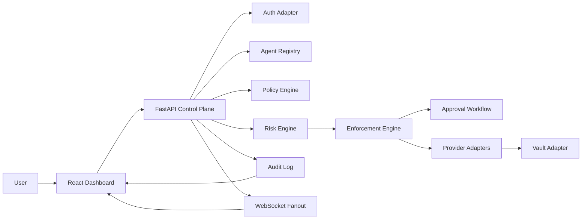

# Chorus Auth Control Plane System Overview

## Executive Summary

Chorus is now a secure control plane for AI agents that act on behalf of users. The platform sits between agents and external providers, enforcing capability grants, evaluating risk, requesting human approval for sensitive actions, and recording a complete audit trail for every decision.

The active MVP uses Gmail and GitHub demo adapters, SQLite for persisted state, Redis for optional live fanout, and a React dashboard that exposes accounts, permissions, approvals, actions, and quarantine state.

## Primary Flow

## Bounded Contexts

### Frontend

- Connected account management
- Agent and capability visibility
- Pending approval queue
- Action submission studio
- Audit timeline and quarantine state

### Backend

- `auth`: resolves the current user in mock mode or through Auth0-compatible headers
- `vault`: mediates provider access and keeps tokens off-agent
- `connections`: stores connected provider accounts and scopes
- `agents`: manages agent records and capability grants
- `policy`: enforces deterministic capability and scope checks
- `risk`: maps actions into low, medium, high, or critical risk with optional Gemini explanation
- `enforcement`: turns policy and risk outputs into `ALLOW`, `REQUIRE_APPROVAL`, `BLOCK`, or `QUARANTINE`
- `actions`: owns action request lifecycle and execution
- `approvals`: resolves human decisions and resumes approved work
- `audit`: appends the execution history shown in the dashboard
- `providers`: executes Gmail and GitHub actions in mock-first mode

## Data Model

The control plane persists the following core entities:

- `users`
- `connected_accounts`
- `agents`
- `capabilities`
- `agent_capability_grants`
- `action_requests`
- `risk_assessments`
- `approval_decisions`
- `execution_records`
- `quarantine_records`
- `audit_events`

## Decision Lifecycle

1. An agent submits an action request through `/api/actions`.
2. The policy engine confirms the capability grant, provider connection, and scope constraints.
3. The risk engine classifies the request and optionally enriches the explanation with Gemini.
4. The enforcement engine decides whether to allow, require approval, block, or quarantine.
5. If allowed, the provider adapter executes with vault-mediated access.
6. Every state transition is written to the audit log and pushed to `/ws/dashboard`.

## Default Demo State

The seeded MVP creates:

- one mock user
- one Gmail connection
- one GitHub connection
- `Assistant Agent`, `Builder Agent`, and `Ops Agent`
- one safe allow path
- one approval-required path
- one block-to-quarantine path

## Runtime Defaults

- `USE_NEW_ACTION_PIPELINE=true`
- `USE_LEGACY_PIPELINE=false`
- `AUTH_MODE=mock`
- `VAULT_MODE=mock`
- `PROVIDER_MODE=mock`
- `SEED_DEMO=true`
- `SEED_ON_STARTUP=true` when launched by `run_frontend_demo.sh`

## Repository Scope

The repository now keeps only the auth control plane path and its supporting demo assets. The older prediction-engine, Kafka, Datadog, and voice-alert experiments have been removed from the active project tree.
